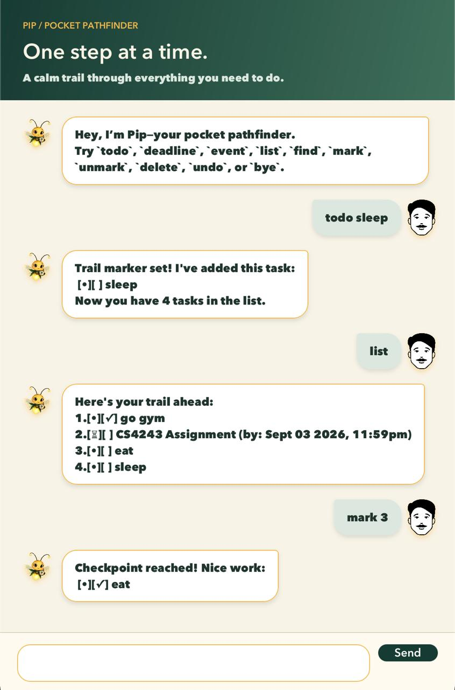

# Pip User Guide

Pip is your friendly pocket pathfinder for keeping everyday tasks on a clear trail. Add todos, deadlines, and
events; find and update them; or retrace your latest step with `undo`.



## Quick start

1. Ensure that **Java 25** is installed on your computer.
1. Place a `pip.jar` built for your operating system and processor in a folder of your choice.
1. Open a terminal in that folder and run:

   ```shell
   java -jar pip.jar
   ```

1. Type a command in the box at the bottom of the window, then press <kbd>Enter</kbd> or select **Send**.

Pip saves every successful change automatically and reloads your tasks the next time it starts from the same
folder.

> [!TIP]
> Command words and markers such as `/by`, `/from`, and `/to` are case-sensitive. Enter them in lowercase as shown
> in this guide. Extra spaces at the start, end, or between words are harmless.

## Understanding the task list

Each task has a type icon and a completion box:

| Symbol | Meaning |
| --- | --- |
| `[•]` | Todo |
| `[⏳]` | Deadline |
| `[◆]` | Event |
| `[ ]` | Not completed |
| `[✓]` | Completed |

For example, `[⏳][✓] submit report (by: Oct 15 2026, 6:30PM)` is a completed deadline.

## Features

### Adding a todo: `todo`

Adds a task without a date or time.

Format: `todo <description>`

Example:

```text
todo buy milk
```

Pip adds `[•][ ] buy milk` to the end of the list.

### Adding a deadline: `deadline`

Adds a task that must be completed by a date, with an optional time.

Format: `deadline <description> /by <date or date-time>`

Examples:

```text
deadline submit report /by 2026-10-15
deadline submit report /by 2026-10-15 1830
deadline submit report /by 15/10/2026 1830
```

Accepted values are `yyyy-MM-dd`, `yyyy-MM-dd HHmm`, and `d/M/yyyy HHmm`. Pip checks calendar dates strictly, so
values such as `2026-02-30` are rejected.

### Adding an event: `event`

Adds a task with a start and end. The start must be earlier than the end.

Format: `event <description> /from <date-time> /to <date-time>`

Example:

```text
event project meeting /from 2026-10-15 1400 /to 2026-10-15 1500
```

Both date-times must use `yyyy-MM-dd HHmm` or `d/M/yyyy HHmm`. Each marker must appear exactly once and in the
order shown.

### Viewing all tasks: `list`

Shows every task with its current number. Use these numbers with `mark`, `unmark`, and `delete`.

```text
list
```

Example output:

```text
Here's your trail ahead:
1.[•][ ] buy milk
2.[⏳][ ] submit report (by: Oct 15 2026, 6:30PM)
```

If there are no tasks, Pip tells you that your trail is clear.

### Finding tasks: `find`

Shows tasks whose descriptions contain the keyword. Matching is case-insensitive, and the displayed numbers are
the tasks' numbers in the full list.

Format: `find <keyword>`

Example:

```text
find report
```

If nothing matches, no task entries appear below the results heading.

### Marking a task as completed: `mark`

Format: `mark <task number>`

Example:

```text
mark 2
```

Pip changes the selected task's completion box to `[✓]`.

### Marking a task as not completed: `unmark`

Format: `unmark <task number>`

Example:

```text
unmark 2
```

Pip changes the selected task's completion box back to `[ ]`.

### Deleting a task: `delete`

Format: `delete <task number>`

Example:

```text
delete 1
```

Pip removes the selected task. Run `list` first if you are unsure of its current number.

### Undoing the latest change: `undo`

Reverses the most recent successful `todo`, `deadline`, `event`, `mark`, `unmark`, or `delete` command.

```text
todo buy milk
undo
```

Example output from `undo`:

```text
One step back—I've removed the task you added:
 [•][ ] buy milk
Now you have 0 tasks in the list.
```

Only one change can be undone. `list`, `find`, and rejected commands do not replace the available undo. Undo
history is cleared when Pip restarts; if there is nothing to undo, Pip displays `No steps to retrace yet.`

### Ending the session: `bye`

```text
bye
```

Pip saves your trail, displays `Trail saved. See you at the next checkpoint!`, and disables command entry. You can
then close the window.

## Input rules and common errors

- Task numbers must be positive whole numbers currently shown by `list`; for example, `mark 1`.
- Task descriptions cannot be empty or longer than 200 characters. Find keywords cannot exceed 100 characters.
- Commands cannot exceed 500 characters.
- Descriptions and keywords may contain ordinary Unicode text and punctuation, but not `|`, line breaks, or control
  characters.
- An exact duplicate task is rejected. Capitalization and repeated whitespace do not make a task unique, although
  deadlines with different due dates and events with different time ranges are allowed.
- Commands without parameters must be entered alone: `list`, `undo`, or `bye`.

When a command is invalid, Pip explains what went wrong and leaves the task list unchanged. For example,
`deadline submit report` produces:

```text
Use this format: deadline <description> /by <date or date-time>
```

## Saving and recovering data

Pip stores tasks in `data/ramly.txt`, relative to the folder from which you launch the JAR. The folder and file are
created automatically when missing.

Avoid editing this file while Pip is running. If Pip finds malformed or duplicate records at startup, it loads the
valid records, reports the skipped line numbers, and creates a `.bak` copy beside the data file. If the file cannot
be accessed or backed up safely, Pip reports the problem and disables command entry. A failed save leaves both the
on-screen task list and the previous data file unchanged.

## Command summary

| Action | Format | Example |
| --- | --- | --- |
| Add a todo | `todo <description>` | `todo buy milk` |
| Add a deadline | `deadline <description> /by <date or date-time>` | `deadline submit report /by 2026-10-15 1830` |
| Add an event | `event <description> /from <date-time> /to <date-time>` | `event meeting /from 2026-10-15 1400 /to 2026-10-15 1500` |
| View all tasks | `list` | `list` |
| Find tasks | `find <keyword>` | `find report` |
| Mark completed | `mark <task number>` | `mark 2` |
| Mark not completed | `unmark <task number>` | `unmark 2` |
| Delete a task | `delete <task number>` | `delete 1` |
| Undo the latest change | `undo` | `undo` |
| End the session | `bye` | `bye` |
